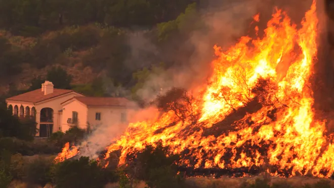

# The 2017 Thomas Fire
### Visualizing the scar with true and false colors



Image credit: [usatoday.com](https://www.usatoday.com/story/news/2017/12/26/californias-largest-recorded-wildfire-winding-down-firefighters-gain-upper-hand/982571001/)

## About
This repository contains notebooks `hwk4-task2-fire-perimeter-CARROLL.ipynb` and `hwk4-task2-false-color-CARROLL.ipynb` which aim to analyze the impact of the 2017 Thomas Fire in Santa Barbara and Ventura Counties.

The intent of this project is to retreive geographic data of California fires, filter, and clean it to specify the 2017 Thomas Fire. This remote sensing and fire perimeter data will be used to create a false-color map of the 2017 Thomas Fire and the surrounding area. The map will indicate the extent of the fire scar, and highlight areas that contain vegetation or bare soil with colors that have more contrast than a true color image. This will be achieved through various data analysis techniques and iterations of plots, outlined below.

## Highlights

- Data wrangling and exploration with `pandas` and `rioxarray`
- Geospatial data wrangling with `geopandas` and `rioxarray`
- CRS conversions between tabular and xarray datasets
- Saving the resulting subset to a local daat folder using `to_file()`
- Using base `plot()` to visualize true color plpots of the fire
- Creating and customizing a false color map using `matplotlib.pyplot`


## Data
The data for this analysis is not housed in this repository, except for the filtered 'thomas_fire' perimeter shapefile. The Landsat and California state fire data was downloaded and used locally from the sources listed below.

## References

1. U.S. Geological Survey. (n.d.). *Landsat 8-9 OLI/TIRS collection 2 level-2 science products | USGS EROS Archive*. U.S. Geological Survey. https://www.usgs.gov/centers/eros/science/usgs-eros-archive-landsat-archives-landsat-8-9-olitirs-collection-2-level-2 Access date: November 19, 2024.

2. Data.gov. (2024). *California fire perimeters (ALL)*. Data.gov. https://catalog.data.gov/dataset/california-fire-perimeters-all-b3436 Access date: November 19, 2024.


## Repository Organization

 ```
 eds220-hwk4-repo
│
├── README.md                     
├── hwk4-task2-fire-perimeter-CARROLL.ipynb  # Jupyter notebook for data filtering
├── hwk4-task2-false-color-CARROLL.ipynb # Jupyter nnotebook for data visualization                    
├── .gitignore                    
│
├── images/                       
│   ├── 2017_thomas_fire_2.jpeg  # Image for README
│ 
├── data/
│   ├── landsat8-2018-01-26-sb-simplified.nc # Landsat data
│   ├── thomas_fire/
│   │   ├── thomas_fire.shp # Thomas fire perimeter
│   ├── ca_fire_perimeter/
│      ├── ca_fire_perimeter.shp # California fire data
```